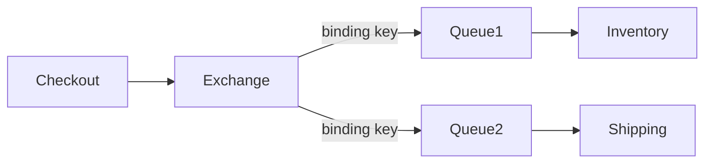

RabbitMQ enables asynchronous processing, meaning that it allows you to put a message in a queue without processing it immediately. 

- implementation of AMQP 0.9.1(advance message queuing protocol) message model
- In this message model, the producer(service that produces message), instead of directly producing to a message queue, it is going to produce to an exchange.
- An exchange can be connected to many queues.
- The consuming services i.e consumers are subscribed to the queue and listens to messages.
- AMQP RabbitMQ is the message broker here.
- In RabbitMQ, the message metadata determines how the message moves(routing key etc)

## Types of Exchange

### Fanout

- checkout(producer) will produce to exchange
  Exchange duplicates the message and send it to every single queue it knows about.

### Direct exchange

- checkout will produce a messsage and that message will have a routing key. The routing key is being compared with the binding key.

### Topic exchange

- partial match between a routing key and binding key

### Header exchange

- routing key is ignored and message is passed based on header.

### Default exchange

(native to RabbitMQ, not a part of AMQP)
routing key = queue name

## Resource

https://www.youtube.com/watch?v=7rkeORD4jSw
