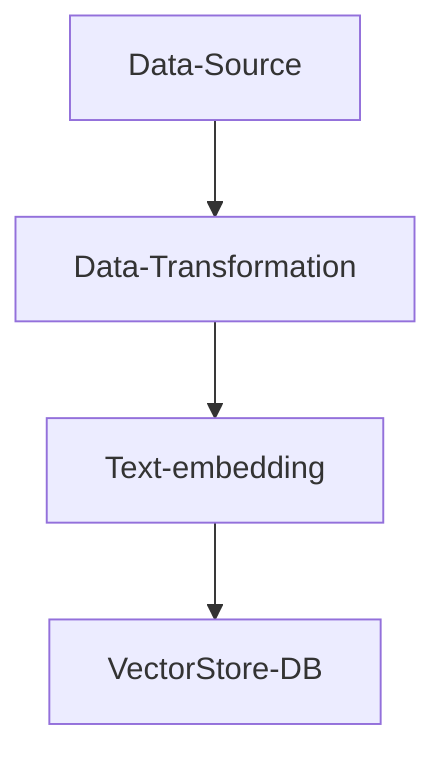

- open source development framework for LLM applications.
- A framework that helps you build LLM-powered apps by handling prompts, memory, tools, and data so you don’t have to reinvent the wheel.
- two packages: python and JS(TS)

With LangChain, you get:
- **Prompt templates**
- **Chains** (step-by-step LLM workflows)
- **Agents** (LLM decides what tool to use)
- **Memory** (conversation state)
- **Retrieval** (RAG with vector databases)
- **Tool calling** (search, DBs, APIs, code)


## Memory
Memory lets the app remember:
- Previous messages
- User preferences
- Intermediate steps

Very useful for chatbots, assistants, and copilots.

### Memory types

**ConversationBufferMemory**
 
This memory allows for storing of messages and then extracts the messages in a variable.
 
**ConversationBufferWindowMemory**

This memory keeps a list of the interactions of the conversation over time. It only uses the last K interactions.
 
**ConversationTokenBufferMemory**
 
This memory keeps a buffer of recent interactions in memory, and uses token length rather than number of interactions to determine when to flush interactions.
 
**ConversationSummaryMemory**
 
This memory creates a summary of the conversation over time.

### Additional Memory Types
 
**Vector data memory** 

Stores text (from conversation or elsewhere) in a vector database and retrieves the most relevant blocks of text.
 
**Entity memories**
 
Using an LLM, it remembers details about specific entities.

You can also use multiple memories at one time.
 
E.g., Conversation memory + Entity memory to recall individuals.
 
You can also store the conversation in a conventional database (such as key-value store or SQL)


## Chains
### LLM Chain
An LLM Chain is:
>A repeatable, parameterized, composable workflow around LLM calls.
- LLMChain is a primitive / building-block chain.
- wraps one prompt + one model call


```py
from langchain.chat_models import ChatOpenAI 
from langchain.prompts import ChatPromptTemplate 
from langchain.chains import LLMChain

llm = ChatOpenAI(temperature=0.9, model=llm_model) 

prompt = ChatPromptTemplate.from_template( "What is the best name to describe \ a company that makes {product}?" ) 

chain = LLMChain(llm=llm, prompt=prompt) 
product = "Queen Size Sheet Set" 
chain.run(product) #Royal Beddings or anything the gpt responds with
```


### SequentialChain

- wires multiple chains together where o/p of one chain is i/p of the next chain.
2 types of sequential chains: 
- **SimpleSequentialChain**: single i/p and o/p
- **SequentialChain**: any step of the chain can take multiple i/p and o/p

**SimpleSequentialChain**
```py
from langchain.chains import SimpleSequentialChain
llm = ChatOpenAI(temperature=0.9, model=llm_model)

# prompt template 1
first_prompt = ChatPromptTemplate.from_template(
    "What is the best name to describe \
    a company that makes {product}?"
)

# Chain 1
chain_one = LLMChain(llm=llm, prompt=first_prompt)

# prompt template 2
second_prompt = ChatPromptTemplate.from_template(
    "Write a 20 words description for the following \
    company:{company_name}"
)
# chain 2
chain_two = LLMChain(llm=llm, prompt=second_prompt)
overall_simple_chain = SimpleSequentialChain(chains=[chain_one, chain_two],
overall_simple_chain.run(product)
```

**SequentialChain**

```py
from langchain.chains import SequentialChain
llm = ChatOpenAI(temperature=0.9, model=llm_model)

# prompt template 1: translate to english
first_prompt = ChatPromptTemplate.from_template(
    "Translate the following review to english:"
    "\n\n{Review}"
)
# chain 1: input= Review and output= English_Review
chain_one = LLMChain(llm=llm, prompt=first_prompt, 
                     output_key="English_Review"
                    )
second_prompt = ChatPromptTemplate.from_template(
    "Can you summarize the following review in 1 sentence:"
    "\n\n{English_Review}"
)
# chain 2: input= English_Review and output= summary
chain_two = LLMChain(llm=llm, prompt=second_prompt, 
                     output_key="summary"
                    )
# prompt template 3: translate to english
third_prompt = ChatPromptTemplate.from_template(
    "What language is the following review:\n\n{Review}"
)
# chain 3: input= Review and output= language
chain_three = LLMChain(llm=llm, prompt=third_prompt,
                       output_key="language"
                      )

# prompt template 4: follow up message
fourth_prompt = ChatPromptTemplate.from_template(
    "Write a follow up response to the following "
    "summary in the specified language:"
    "\n\nSummary: {summary}\n\nLanguage: {language}"
)
# chain 4: input= summary, language and output= followup_message
chain_four = LLMChain(llm=llm, prompt=fourth_prompt,
                      output_key="followup_message"
                     )
# overall_chain: input= Review 
# and output= English_Review,summary, followup_message
overall_chain = SequentialChain(
    chains=[chain_one, chain_two, chain_three, chain_four],
    input_variables=["Review"],
    output_variables=["English_Review", "summary","followup_message"],
    verbose=True
)

review = "add some review here"
overall_chain(review)
```

### Router Chain
A Router Chain is a LangChain pattern used when you don’t want one single prompt or chain to handle every input, but instead want the system to decide which chain should run based on the input.

Think of it as an LLM-powered if / else or switch statement.
**The core idea** : Given an input, choose the most appropriate chain to handle it.
Example:
If input is a math question → use math chain
If input is code-related → use coding chain
If input is customer support → use support chain
You route the request to the right specialist

### Key benefits of using Chain

🔹 **1. Prompt templating & variable injection**
This becomes powerful when: Prompts are long, Variables are many, Prompts are reused across files.

**🔹 2. Reusability & maintainability** 
You define the prompt once, Instead of copy-pasting prompts everywhere.
```py
chain.run("Queen Size Sheet Set")
chain.run("Organic Soap")
chain.run("AI SaaS Platform")
```
**🔹 3. Easy model swapping & configuration**
Change model/temperature without touching your logic.
```py
llm = ChatOpenAI(model="gpt-4", temperature=0.2)
```
**🔹 4. Multi-step workflows (SequentialChain)**
While an LLMChain represents a single step, real power comes from composing multiple LLMChains using SequentialChain, RouterChain, or Agents.

**🔹 5. Composition(chains calling chains) with tools, memory, retrievers**

Chains can be stacked:
```py
User Input
   ↓
Summarization Chain
   ↓
Translation Chain
   ↓
Tone Adjustment Chain
   ↓
Final Output
```

Chains can integrate: 🔍 Vector databases, 🧠 Conversation memory, 🛠️ Tools & function calling, 🔄 Retries & fallback models, 📊 Tracing & observability

Example:

```py

User Question
   ↓
Retrieve relevant docs
   ↓
Insert into prompt
   ↓
LLM answers with citations
```
This is the backbone of RAG (Retrieval-Augmented Generation).

## Retrieval (RAG)

LangChain makes it easy to:
- Load documents (PDFs, Notion, websites)
- Embed them into vectors
- Store them in a vector database
- Retrieve relevant chunks
- Inject them into the prompt

This pattern is called **Retrieval-Augmented Generation (RAG)**.

### Common components of RAG(Retrieval Augmented Generation)



- **Data-Ingestion**: (Load data into langchain/Data ingestion)

- **Data-Transformation** : (breaking data into text chunks)

- **Embedding**: converting text into vectors using embedding techniques. This is required for different algorithms to run(similarity serach). 

- **VectorStore-DB**: saving vectors into a vector DB ex: chromaDB, FAISS, ASTRADB

The details are present in their invdiviual pages below

### Data Ingestion:
[[learning.langchain.document-ingestion]]

### Data-Transformation(Text splitting)
[[learning.langchain.text-splitting]]

### Embeddings
[[learning.langchain.embeddings]]


## Tools
Tools can be things like:
- Web search
- SQL queries
- Python execution
- APIs
- File systems

LangChain gives a standard way to expose these tools to an LLM.