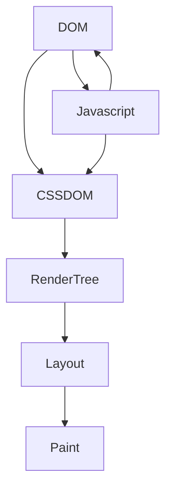
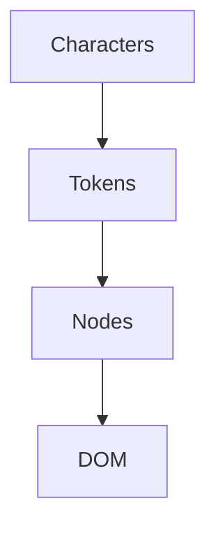

## Critical Rendering Path

- sequence of steps the browser goes through to render the page ie. to convert html, css, js to pixels on your screen.

### DOM
- browser captures all contents of the page in DOM
- full parsed representation of HTML markup.
- browser constructs DOM incrementaly(building the dom as soon as we have the HTMl and not have to wait for entire HTMl page to render)
- creates DOM based on token hierarchy

### CSSOM
- browser captures all the styles of the page in a CSS OM
converts token to Nodes
- css rules cascade down(children of body note inherit its parent's css)
- can't use partial CSSOM since rules are overwritten
- it is render blocking(browser blocks page rendering until the entire cssom is created)
- more specific rules are expensive.

### Render Tree
- merge the two DOM and CSSOM in render tree
- only captures visible content.
### Layout
determines the scrren size and position of each node in the screen.

### Paint
Paints pixels on the scrren

## Optimizing CRP
-  minimizing the number of critical resources by deferring non-critical ones' download, marking them as async,
- optimizing the number of requests required along with the file size of each request,
- optimizing the order in which critical resources are loaded by prioritizing the downloading of critical assets, thereby shortening the critical path length.